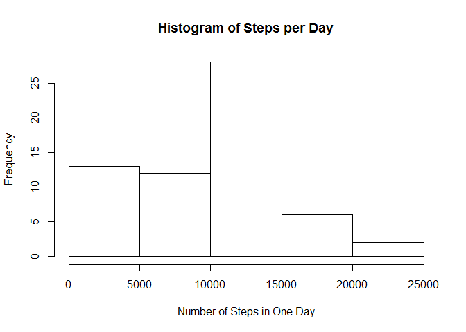
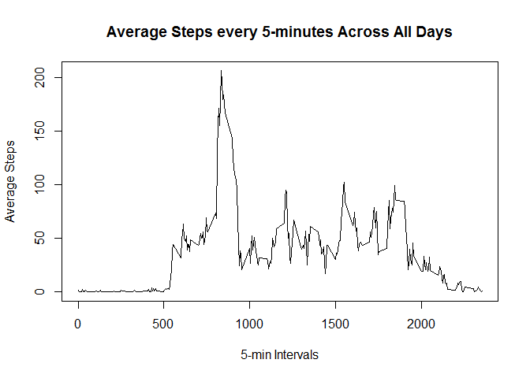
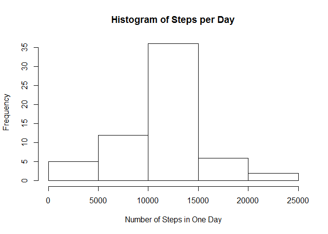
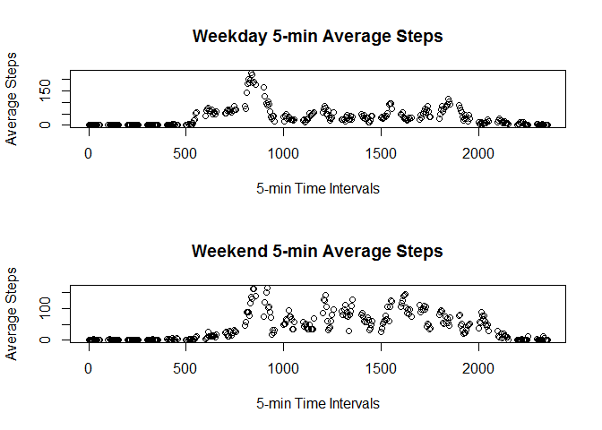

# Reproducible Research: Peer Assessment 1


## Loading and preprocessing the data
First load the data

```r
raw <- read.csv("activity.csv")
```

Extract the dates and intervals from the data

```r
dates <- levels(raw$date)
intv <- unique(raw$interval)
```


## What is mean total number of steps taken per day?
Cycle through each unique day and find the total number of steps during that day

```r
totstepsday <- NULL
for (i in 1:length(dates)) {
    totstepsday[i] <- sum(raw$steps[raw$date==dates[i]],na.rm=TRUE)
}
```

Now generate a histogram for how often a certain range of steps are taken each day

```r
hist(totstepsday, main = paste("Histogram of Steps per Day"), xlab = "Number of Steps in One Day")
```

 

Mean total steps in a day

```r
mean(totstepsday, na.rm=TRUE)
```

```
## [1] 9354.23
```

Median total steps in a day

```r
median(totstepsday, na.rm=TRUE)
```

```
## [1] 10395
```


## What is the average daily activity pattern?
Cycle through each unique 5-min interval and find the average number of steps averaged over all the days

```r
mean5 <- NULL
for (i in 1:length(intv)) {
    mean5[i] <- mean(raw$steps[raw$interval==intv[i]],na.rm=TRUE)
}
```

Plot these averages against the 5-min time intervals

```r
plot(intv, mean5, type="l", main = paste("Average Steps every 5-minutes Across All Days"), xlab = "5-min Intervals", ylab = "Average Steps")
```

 

Time interval with the most average number of steps. This shows that the subject averages the most number of steps during this 5-min interval every day.

```r
intv[which.max(mean5)]
```

```
## [1] 835
```


## Inputing missing values
Need the library plyr to use the count function for counting the number of NAs in the dataset

```r
library(plyr)
count(raw[is.na(raw)])
```

```
##      x freq
## 1 <NA> 2304
```

Copy original dataset to a new dataset

```r
raw2 <- raw
```

Convert all the NAs in the dataset to their respective 5-min interval's number of steps value

```r
for (i in 1:length(intv)) {
    raw2$steps[is.na(raw2$steps) & raw2$interval==intv[i]] <- mean5[i]
}
```

Cycle through each day and find the total number of steps per day again

```r
totstepsday2 <- NULL
for (i in 1:length(dates)) {
    totstepsday2[i] <- sum(raw2$steps[raw2$date==dates[i]],na.rm=TRUE)
}
```

Generate a new histogram for how often a certain range of steps are taken each day

```r
hist(totstepsday2, main = paste("Histogram of Steps per Day"), xlab = "Number of Steps in One Day")
```

 

Updated mean total steps in a day (top) compared to original mean total steps in a day (bottom)

```r
mean(totstepsday2, na.rm=TRUE)
```

```
## [1] 10766.19
```

```r
mean(totstepsday, na.rm=TRUE)
```

```
## [1] 9354.23
```

Updated median total steps in a day (top) compared to original median total steps in a day (bottom)

```r
median(totstepsday2, na.rm=TRUE)
```

```
## [1] 10766.19
```

```r
median(totstepsday, na.rm=TRUE)
```

```
## [1] 10395
```

These values are expected to be different and greater because more non-negative values are being added to the dataset in place of the NAs. Therefore, the mean and medians have increased.


## Are there differences in activity patterns between weekdays and weekends?
Sort a new vector for weekend or weekday based on date column in the updated dataset raw2

```r
Isweekend <- weekdays(as.Date(raw2$date))
weekDE <- NULL
for (i in 1:length(Isweekend)) {
    if (Isweekend[i] == "Saturday" | Isweekend[i] == "Sunday") {
        weekDE[i] <- "weekend"
    }
    else {
        weekDE[i] <- "weekday"
    }
}
```

Combine the weekday/end column with the dataset data frame

```r
raw2 <- cbind(raw2,weekDE)
```

Find the mean of 5-min intervals across all weekdays and weekends separately

```r
mean5d <- NULL
mean5e <- NULL
for (i in 1:length(intv)) {
    mean5d[i] <- mean(raw2$steps[raw2$interval==intv[i] & raw2$weekDE=="weekday"])
    mean5e[i] <- mean(raw2$steps[raw2$interval==intv[i] & raw2$weekDE=="weekend"])
}
```

Using par to form the layout for the upcoming plots and plot the weekday and weekend average steps

```r
par(mfrow=c(2,1)) #2 rows, 1 column
plot(intv, mean5d, main="Weekday 5-min Average Steps", xlab="5-min Time Intervals", ylab="Average Steps")
plot(intv, mean5e, main="Weekend 5-min Average Steps", xlab="5-min Time Intervals", ylab="Average Steps")
```

 

There appears to be more average steps taken over the weekend than that of the average steps on weekdays.
